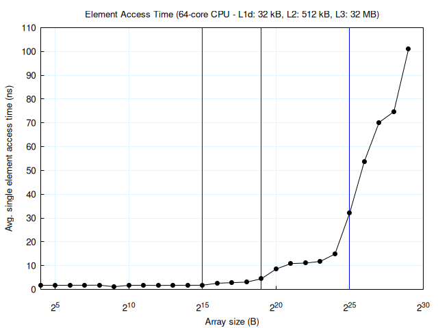

# CPU Cache Benchmarks

Check the [Makefile](Makefile) for available benchmarks.

NOTE: These are **not production-level benchmarks** and are only for
educational purposes. Results are **not** representative of actual performance.

Sample graph:

## Recommended Settings

### BIOS

- NPS4
- Disable prefetchers

### OS

- Pin software to core and memory
