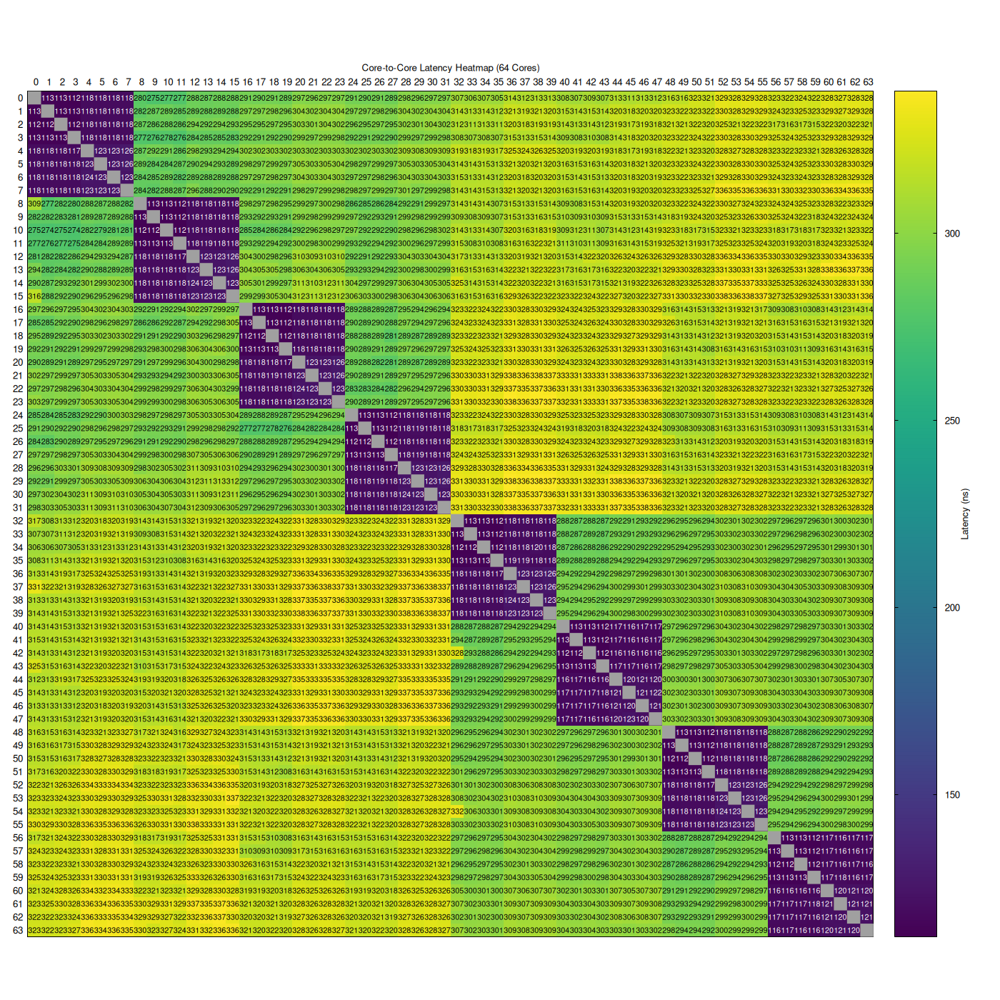

# CPU Core Benchmarks

## Introduction

CPU core-related benchmarks. These are not production-level benchmarks and are
only for experimental and educational purposes.

## Benchmarks

### Ping Pong

Measure core-to-core latency, i.e., the time it takes one cache line to migrate
from one core to the other.

```shell
$ make ping-pong
$ ./ping-pong
```

#### Plotting Heatmap

The ping-pong benchmark generates a CSV file that can be used to generate a
heatmap PNG image using Gnuplot.

```shell
$ make plot-ping-pong-heatmap
```

Sample heatmap for a 64 core server:



## Settings

Some of these settings make preheating the core (running a loop to awaken the
core and boost its frequency) less important, especially for amateur benchmarks.

### BIOS

- SMT Disabled
- CPB Disabled
- Global C-State Disabled
- Determinism = Performance
- APBDIS Enabled
- DF C-States Disabled
- DF P-State = P0
- NPS4
- L3 as NUMA Domain Enabled
- L1 Stream Prefetcher Disabled
- L2 Stream Prefetcher Disabled
- Memory Interleaving Disabled
- DRAM Scrub Time Disabled
- DDR4-3200
- IOMMU Disabled

### Linux OS

- Set the CPU frequency governor to 'performance'

    ```shell
    $ cpupower frequency-info # available options and current option
    $ sudo cpupower frequency-set -g performance
    ```

## Learning

The CPU core benchmarks contain (for now) some learning code snippets to get
into pthreads and atomic operations to be able to write core-related benchmarks.

Go through the [Makefile](Makefile) in this directory to find the learning
benchmarks to build. Then use the following commands to run them.

```shell
$ make <benchmark_target_to_build_from_makefile>
$ ./benchmark-name
```

## Resources

- [Multithreaded Programming (POSIX pthreads Tutorial)](https://randu.org/tutorials/threads)
- [Mastering Concurrency in C with Pthreads: A Comprehensive Guide](https://dev.to/emanuelgustafzon/mastering-concurrency-in-c-with-pthreads-a-comprehensive-guide-56je)
- [How to Create a Thread and Execute It on Specific CPU Core](https://errbits.com/articles/how-to-create-a-thread-and-execute-it-on-specific-cpu-core.html)
- [How to Pin a Thread to a Specific Core in a Cpuset Using C: C APIs, Parsing Cpuset, and Best Practices](https://www.funwithlinux.net/blog/pinning-a-thread-to-a-core-in-a-cpuset-through-c)
- [Atomic Operations in C](https://dotnettutorials.net/lesson/atomic-operations-in-c)
- [Sample program using pthread barriers](https://github.com/angrave/SystemProgramming/wiki/Sample-program-using-pthread-barriers)
