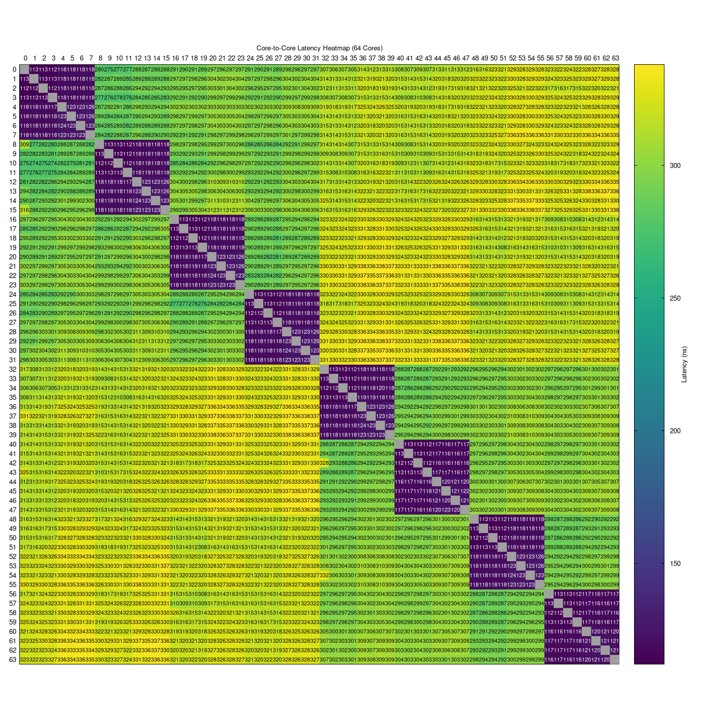
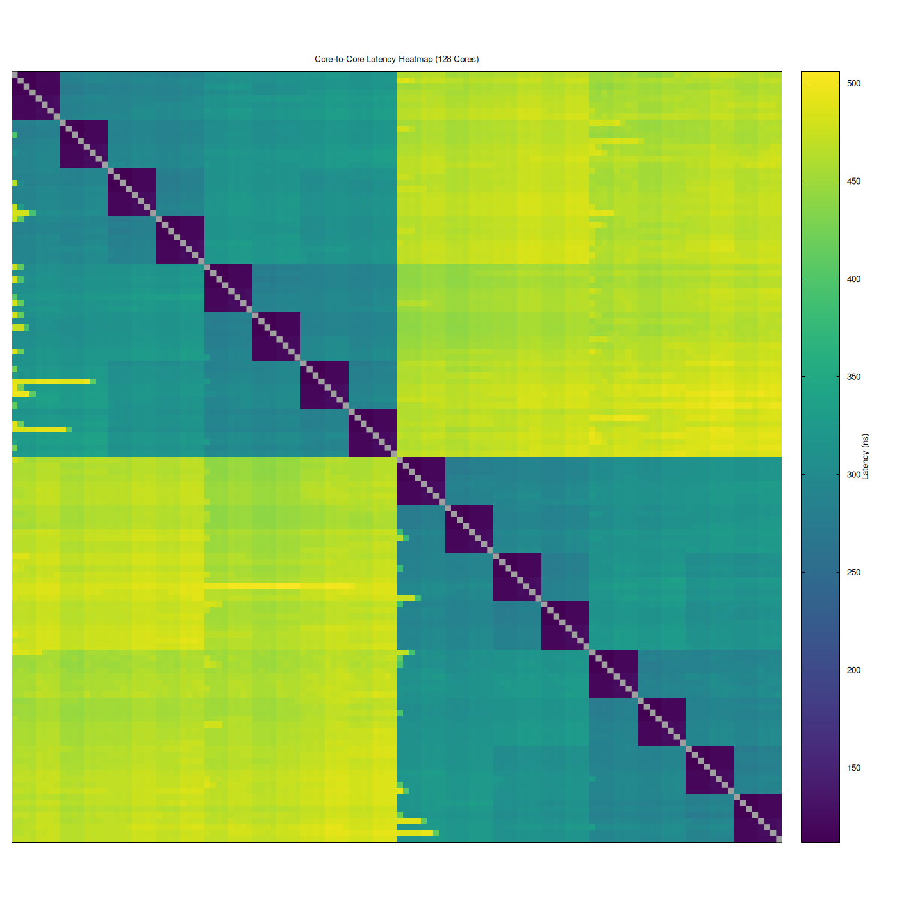

# CPU Core Benchmarks

## Introduction

CPU core-related benchmarks.

NOTE: These are **not production-level benchmarks** and are only for
educational purposes. Results are **not** representative of actual performance.

## Benchmarks

### Ping Pong

Measure core-to-core latency, i.e., the time it takes one cache line to migrate
from one core to the other.

```shell
$ make ping-pong
$ ./ping-pong
```

#### Plotting Heatmap

The ping-pong benchmark generates a CSV file that can be used to generate a
heatmap PNG image using Gnuplot.

```shell
$ make plot-ping-pong-heatmap
```

Sample heatmap for a 1P 64-core system (one system with one CPU having 64 cores):



Sample heatmap for a 2P 128-core system (one system with two CPUs having 64 cores each):



## Prerequisites and Settings

The goal is to measure the underlying cache coherency and fabric latency with
minimal interference from power management, scheduling and topology ambiguity.

Some of these settings make preheating the core (running a loop to awaken the
core and boost its frequency) less important, especially for amateur benchmarks.

### BIOS

NOTE: Make sure to restore the BIOS to defaults before making the following
changes.

#### Required BIOS Settings

These settings directly affect the latency being measured and should be
considered required.

- SMT = Disabled
- Determinism = Performance
- Core Performance Boost (CPB) = Disabled
- Global C-State Control (for CPU cores) = Disabled
- APBDIS = Enabled
- DF C-States = Disabled
- DF P-State = P0
- NPS = NPS4
- L3 as NUMA Domain = Enabled

For a 2P system (system with two CPU sockets), in addition to the above settings
treat the following as required BIOS settings as well.

- Cross-socket communication (AMD calls it xGMI and Intel calls it UPI)
    - Link configuration = Maximum supported value
    - Link width = Maximum supported value
        - Force link width to the maximum value if available
    - Link speed = Maximum supported value

#### Benchmark Noise Reduction BIOS Settings

These settings generally do not change true fabric latency but may reduce
run-to-run variability.

- Memory Interleaving = Disabled
- DRAM Scrub Time = Disabled
- IOMMU = Disabled

#### Benchmark Hygiene BIOS Settings

These settings improve reproducibility but generally do not materially affect
measured latency.

- TDP = Maximum validated value
- Package Power = Maximum validated value

### OS

- Linux (Ubuntu 24.04.4)
- Software prerequisites: GCC and Make
- Set the CPU frequency governor to 'performance'

    ```shell
    $ cpupower frequency-info # available options and current option
    $ sudo cpupower frequency-set -g performance
    ```

## Learning

The CPU core benchmarks contain (for now) some learning code snippets to get
into pthreads and atomic operations to be able to write core-related benchmarks.

Go through the [Makefile](Makefile) in this directory to find the learning
benchmarks to build. Then use the following commands to run them.

```shell
$ make <benchmark_target_to_build_from_makefile>
$ ./benchmark-name
```

## Resources

- [Multithreaded Programming (POSIX pthreads Tutorial)](https://randu.org/tutorials/threads)
- [Mastering Concurrency in C with Pthreads: A Comprehensive Guide](https://dev.to/emanuelgustafzon/mastering-concurrency-in-c-with-pthreads-a-comprehensive-guide-56je)
- [How to Create a Thread and Execute It on Specific CPU Core](https://errbits.com/articles/how-to-create-a-thread-and-execute-it-on-specific-cpu-core.html)
- [How to Pin a Thread to a Specific Core in a Cpuset Using C: C APIs, Parsing Cpuset, and Best Practices](https://www.funwithlinux.net/blog/pinning-a-thread-to-a-core-in-a-cpuset-through-c)
- [Atomic Operations in C](https://dotnettutorials.net/lesson/atomic-operations-in-c)
- [Sample program using pthread barriers](https://github.com/angrave/SystemProgramming/wiki/Sample-program-using-pthread-barriers)
