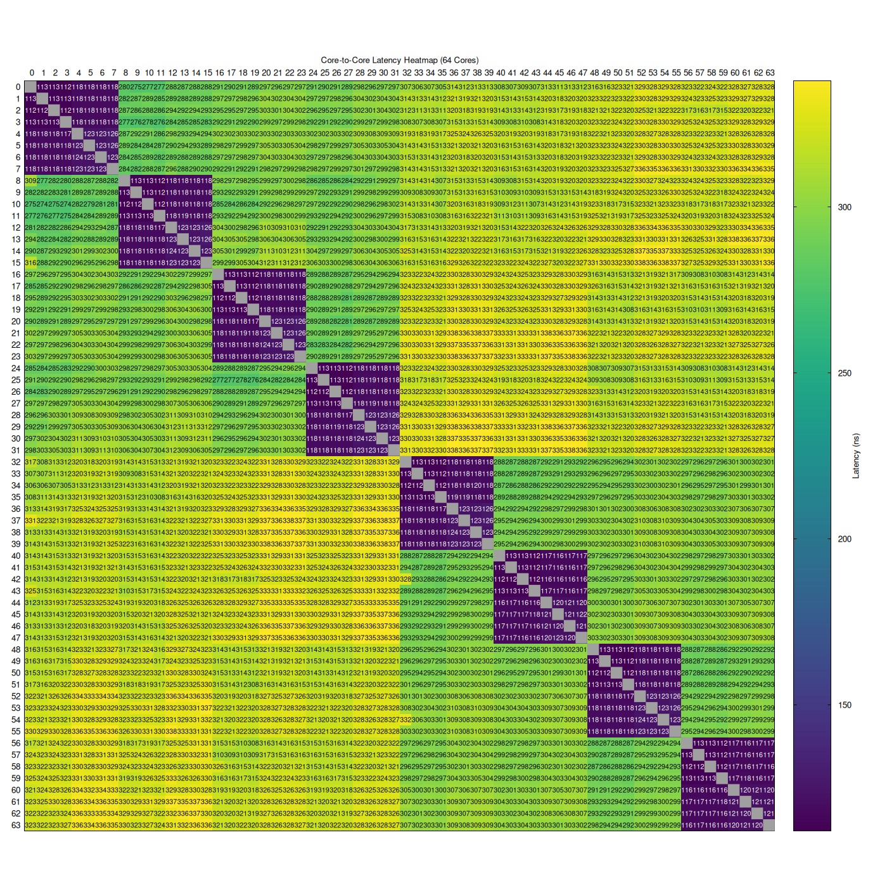
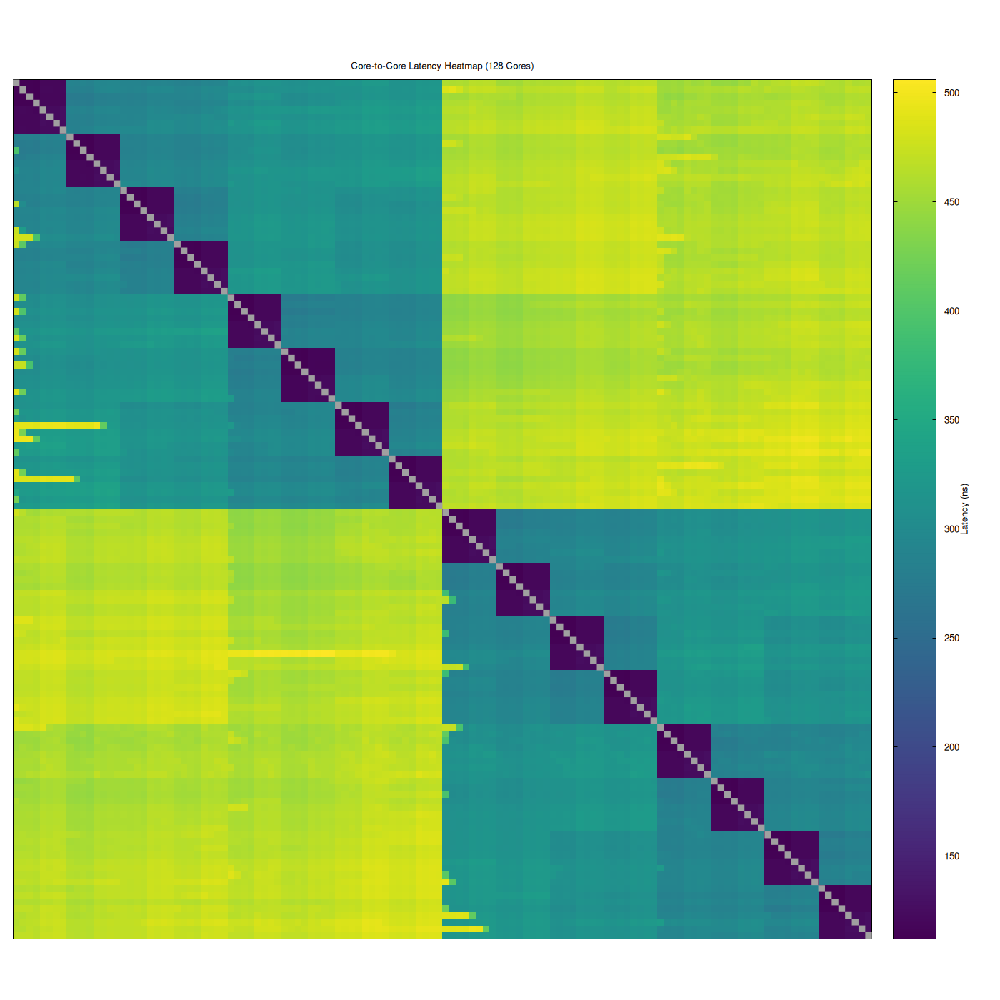
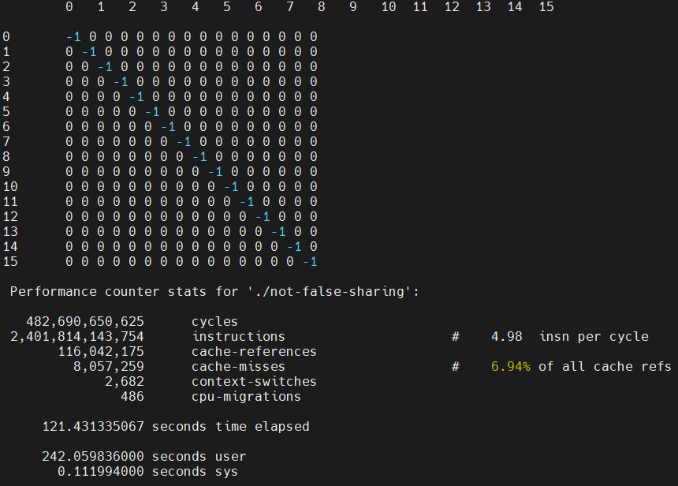
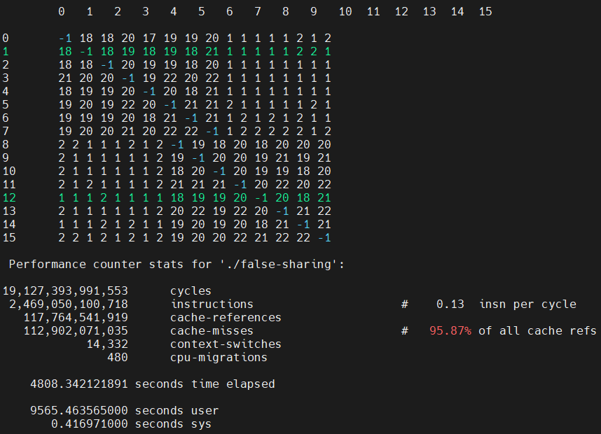

# CPU Core Benchmarks

## Introduction

CPU core-related benchmarks.

NOTE: These are **not production-level benchmarks** and are only for
educational purposes. Results are **not** representative of actual performance.

## Benchmarks

### Ping Pong

Measure core-to-core latency, i.e., the time it takes one cache line to migrate
from one core to the other.

```shell
$ make ping-pong
$ ./ping-pong
```

#### Plotting the Heatmap

The ping-pong benchmark generates a CSV file that can be used to generate a
heatmap PNG image using Gnuplot.

NOTE: Make sure to change the no. of physical cores variable in
[`ping-pong.c`](src/ping-pong.c) before compiling the benchmark.

```shell
$ make plot-ping-pong-heatmap
```

Sample heatmap for a 1P 64-core system (one system with one CPU having 64 cores):



Sample heatmap for a 2P 128-core system (one system with two CPUs having 64
cores each):



### False Sharing

Measuring how much CPU performance loss and more time it takes to update a
variable when another variable is on the same cache line and both are being used
at the same time.

#### Background

Prerequisite: Understanding what a cache line is and its need.

When one variable is used by two threads at the same time, the programmer
understands that this is **true sharing** of data between two resources
(threads), which reduces performance relative to just one thread updating the
variable.

When there are two different variables, each being updated by a different
thread, there can be two cases:

- The two variables are on different cache lines
    - Each core executing each thread is able to take ownership of the cache
      line on which its variable exists and makes all the required updates to it
      independently, not yielding ownership to the cache line until all of its
      updating work on it is done.
    - The program's performance behaves as the programmer expects with two
      independent variables, i.e., really good performance that is equivalent to
      one thread independently updating one unshared variable.
- The two variables are on the same cache line
    - Each core executing each thread is only temporarily able to take ownership
      of the cache line, as both variables exist on one cache line itself. Each
      thread wants to update their own variable independently, but as both
      variables are on the same cache line, the core executing a thread's
      instructions has to request the cache line from the other core to do some
      of its work on its variable before giving it back to the previous core, as
      that core also has to finish its work of updating its own varialble that
      also lives on the same cache line, causing the cache line to randomly ping
      pong between the two cores. This ping pong of the cache line tanks
      performance, as the cores are not able to complete their work all at once
      and have to bear the cost of the cache line yield and ownership process
      (the MESI protocol and its variants) multiple times througout the entire
      update work it is supposed to do.
        - It is not clear to me what defines the duration of ownership of the
          cache line when two threads are working on it at the same time.
          Probably some processor architecture-dependent stuff.
    - The programmer is not aware of the internals of the hardware, but observes
      reduced performance with independent operations on two seemingly
      independent variables, which makes this **false sharing** from the
      programmer's perspective, even though it makes sense from the hardware's
      perspective.

#### Running the Benchmarks

NOTE:

- Make sure to change the no. of physical cores variable in
  [`false-sharing.c`](src/false-sharing.c) and
  [`not-false-sharing.c`](src/not-false-sharing.c) before compiling the benchmarks.
- The generate CSVs are not as important. The [`perf`](https://perfwiki.github.io/main)
  output is much more important.

```shell
# To build
$ make not-false-sharing
$ make false-sharing

# To run
$ sudo perf stat -e cycles,instructions,cache-references,cache-misses,context-switches,cpu-migrations ./not-false-sharing
$ sudo perf stat -e cycles,instructions,cache-references,cache-misses,context-switches,cpu-migrations ./false-sharing
```

Non-false sharing output from a 16-core test:



False sharing output from a 16-core test:



The Instructions per Cycle (IPC) is 4.98 for the non-false sharing benchmark,
while it is just 0.13 for the false sharing benchmark, which shows that the
cores were waiting for the cache line for most of the time. This is a reduction
of IPC by ~97.4%!

Also, the cache miss in the non-false sharing benchmark was at a mere 6.94%,
while the false sharing benchmark was at a whopping 95.87% of all cache
references being cache misses, which also shows the bouncing of the cache line.
This is a ~14,000x increase in cache misses!

The time taken to run the two programs also differs. The non-false sharing
benchmark took ~121 seconds (~2 mins), while the false sharing one took ~4808
seconds (~80 mins)! This is a slowdown of ~39.6%!

## Prerequisites and Settings

The goal is to measure the underlying cache coherency and fabric latency with
minimal interference from power management, scheduling and topology ambiguity.

Some of these settings make preheating the core (running a loop to awaken the
core and boost its frequency) less important, especially for amateur benchmarks.

### BIOS

NOTE: Make sure to restore the BIOS to defaults before making the following
changes.

#### Required BIOS Settings

These settings directly affect the latency being measured and should be
considered required.

- SMT = Disabled
- Determinism = Performance
- Core Performance Boost (CPB) = Disabled
- Global C-State Control (for CPU cores) = Disabled
- APBDIS = Enabled
- DF C-States = Disabled
- DF P-State = P0
- NPS = NPS4
- L3 as NUMA Domain = Enabled

For a 2P system (system with two CPU sockets), in addition to the above settings
treat the following as required BIOS settings as well.

- Cross-socket communication (AMD calls it xGMI and Intel calls it UPI)
    - Link configuration = Maximum supported value
    - Link width = Maximum supported value
        - Force link width to the maximum value if available
    - Link speed = Maximum supported value

#### Benchmark Noise Reduction BIOS Settings

These settings generally do not change true fabric latency but may reduce
run-to-run variability.

- Memory Interleaving = Disabled
- DRAM Scrub Time = Disabled
- IOMMU = Disabled

#### Benchmark Hygiene BIOS Settings

These settings improve reproducibility but generally do not materially affect
measured latency.

- TDP = Maximum validated value
- Package Power = Maximum validated value

### OS

- Linux (Ubuntu 24.04.4)
- Software prerequisites: GCC and Make
- Set the CPU frequency governor to 'performance'

    ```shell
    $ cpupower frequency-info # available options and current option
    $ sudo cpupower frequency-set -g performance
    ```

### CPU

An AMD Zen 3 CPU was used for the sample measurements.

NOTE: These are **not production-level benchmarks** and are only for
educational purposes. Results are **not** representative of actual performance.

## Learning

The CPU core benchmarks contain (for now) some learning code snippets to get
into pthreads and atomic operations to be able to write core-related benchmarks.

Go through the [Makefile](Makefile) in this directory to find the learning
benchmarks to build. Then use the following commands to run them.

```shell
$ make <benchmark_target_to_build_from_makefile>
$ ./benchmark-name
```

## Resources

- [Benchmarking - It's About Time - Matt Godbolt - C++Now 2026](https://www.youtube.com/watch?v=EU_nQh8wg5A)
- [Why CPU Time ≠ Wall Clock Time! - Computerphile](https://www.youtube.com/watch?v=xs5iOwkX9fU)
- [Profit or Poverty: False Sharing](https://www.youtube.com/watch?v=9lpbN7FXfy8)
- [The Cost of Concurrency Coordination with Jon Gjengset](https://www.youtube.com/watch?v=tND-wBBZ8RY)
- [Multithreaded Programming (POSIX pthreads Tutorial)](https://randu.org/tutorials/threads)
- [Mastering Concurrency in C with Pthreads: A Comprehensive Guide](https://dev.to/emanuelgustafzon/mastering-concurrency-in-c-with-pthreads-a-comprehensive-guide-56je)
- [How to Create a Thread and Execute It on Specific CPU Core](https://errbits.com/articles/how-to-create-a-thread-and-execute-it-on-specific-cpu-core.html)
- [How to Pin a Thread to a Specific Core in a Cpuset Using C: C APIs, Parsing Cpuset, and Best Practices](https://www.funwithlinux.net/blog/pinning-a-thread-to-a-core-in-a-cpuset-through-c)
- [Atomic Operations in C](https://dotnettutorials.net/lesson/atomic-operations-in-c)
- [Sample program using pthread barriers](https://github.com/angrave/SystemProgramming/wiki/Sample-program-using-pthread-barriers)
