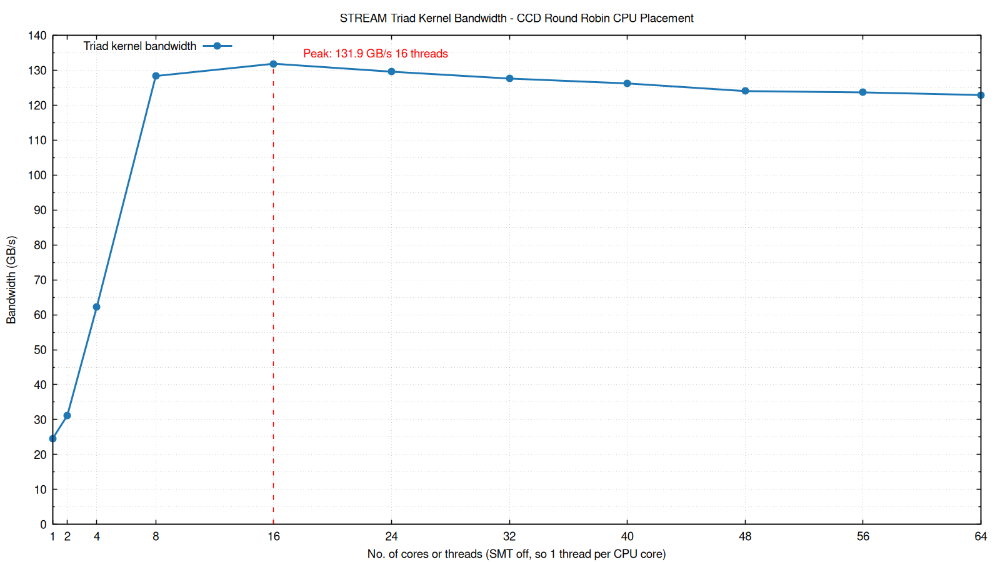
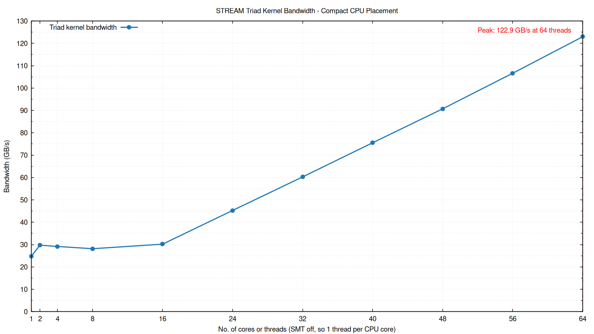

# Stream

## Introduction

A benchmark to measure the memory bandwidth of a system.

This is an amateur replication of [the original STREAM benchmark](https://www.cs.virginia.edu/stream/ref.html).

NOTE: These are **not production-level benchmarks** and are only for
educational purposes. Results are **not** representative of actual performance.





## Build, Run and Plotting Instructions

```shell
# Build
$ make install-dep
$ make stream

# Run
$ ./run-stream

# Plot Stream graphs
$ make plot
```

## Prerequisites and Settings

### BIOS

NOTE: Make sure to restore the BIOS to defaults before making the following
changes.

#### Required BIOS Settings

These settings directly affect the bandwidth being measured and should be
considered required.

- SMT = Disabled
- NPS = NPS4

#### Benchmark Noise Reduction and Reproducibility BIOS Settings

These settings generally do not affect the bandwidth but may reduce run-to-run
variability.

- Determinism = Performance
- Core Performance Boost (CPB) = Disabled
- Global C-State Control (for CPU cores) = Disabled
- DF C-States = Disabled
- DF P-State = P0

### OS

- Linux (Ubuntu 24.04.4)
- Software prerequisites: GCC and Make
- Run `make install-dep` to install software packages required for compilation
- Set the CPU frequency governor to 'performance'

    ```shell
    $ cpupower frequency-info # available options and current option
    $ sudo cpupower frequency-set -g performance
    ```

### CPU

An AMD Zen 3 CPU was used for the sample measurements.

NOTE: These are **not production-level benchmarks** and are only for
educational purposes. Results are **not** representative of actual performance.

## Learning

Go through the [Makefile](Makefile) in this directory to find the learning
benchmarks to build. Then use the following commands to run them.

```shell
$ make install-dep
$ make openmp-basics
$ ./openmp-basics
```
